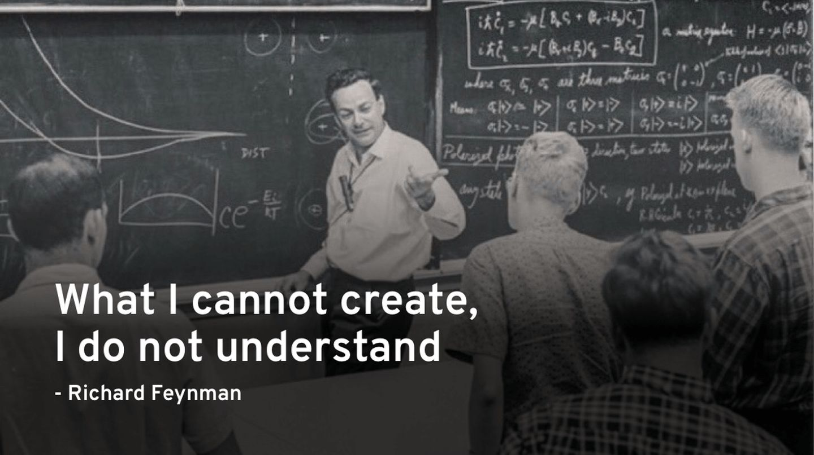

### Hi there 👋

This is Qiming (启明)

**I’m currently Looking at & Working on & Planning TODO**
- [x] Memory/Address/Thread Sanitizer: arts of debugging
  - [x] Address Sanitizer: [AddressSanitizer: A Fast Address Sanity Checker](https://www.usenix.org/system/files/conference/atc12/atc12-final39.pdf)
  - [x] Thread Sanitizer: [ThreadSanitizer – data race detection in practice](https://research.google.com/pubs/archive/35604.pdf)
- [ ] Database System (PingCap-TiDB)
  - [ ] Volcano/Cascades Optimizer
  - [ ] Histogram/Count-Min-Sketch based index ordering, Skyline pruning operator 
- [x] Compiling-Related
  - [ ] Language Virtual Machine
    - [x] Garbage Collector
  - [x] Build simple Interpreter & Compiler from scratch
  - [x] Polyhedral optimizations theories (a bunch of mathematical techniques)
  - [x] Learn Halide (&TVM) schedule generation
  - [ ] Functional Programming Language Compiler
- [x] Practise full-stack skills using React + Spring Boot + Redis/MySQL

**Lifelong Learning, DAY-DAY-UP!**
